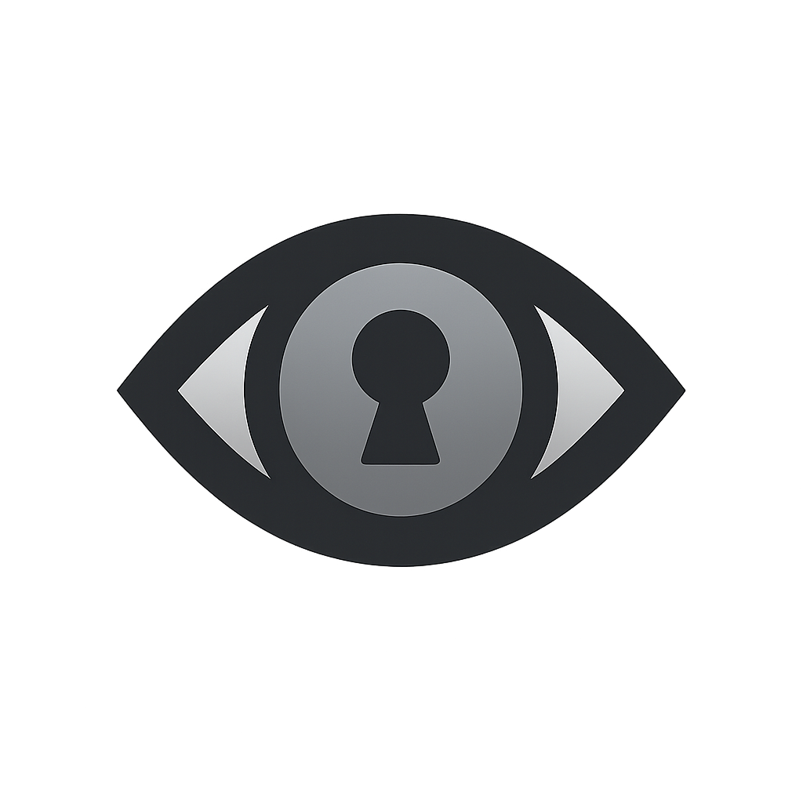

<p align="center">
  
</p>

<h1 align="center">Vigil</h1>

<p align="center">
  <strong>Lock your Mac. Keep your work running.</strong>
</p>

<p align="center">
  A lightweight native macOS utility that blocks all physical input system-wide<br/>
  while keeping your long-running workloads — builds, renders, downloads — fully active.
</p>

<p align="center">
  <a href="https://github.com/e-palmisano/Vigil/releases/latest">
    
  </a>
</p>

<p align="center">
  
  
  
  
  <a href="https://github.com/e-palmisano/Vigil/actions/workflows/ci.yml"></a>
  <a href="https://github.com/e-palmisano/Vigil"></a>
  <a href="https://www.linkedin.com/in/enzo-palmisano-b16363147/"></a>
</p>

---

## Features

- 🔒 **Visible Lock** — blocks all input while keeping your screen visible
- 🖤 **Obscured Lock** — covers every display with a full-screen overlay
- 👆 **Touch ID unlock** with automatic password fallback
- 🖥️ **Multi-display support** — overlays all connected screens, updates on hot-plug
- ☕ **Sleep prevention** — keeps your Mac awake while locked
- ⌨️ **Global shortcuts** — lock from any app, instantly
- 🍎 **Menu bar integration** — one click away, always
- 🔕 **No telemetry** — fully local, no network calls

---

## Install

### Homebrew (recommended)

```bash
brew install --cask e-palmisano/tap/vigil
```

### Manual

Download the latest `.dmg` from [Releases](https://github.com/e-palmisano/vigil/releases), open it, and drag **Vigil.app** to `/Applications`.

---

## First Launch

Vigil needs **Accessibility permission** to block system-wide input via CGEventTap.

On the first lock attempt macOS will prompt you automatically. To grant it manually:

1. Open **System Settings**
2. Go to **Privacy & Security → Accessibility**
3. Enable the toggle next to **Vigil**

> Without this permission the lock will silently no-op. If Vigil isn't blocking input, this is the first thing to check.

---

## Keyboard Shortcuts

| Action | Shortcut |
|--------|----------|
| Lock Visibly | `⌃⌘L` |
| Lock & Obscure | `⌃⇧⌘L` |
| Emergency Unlock | `⌃⌥⌘V` (hold 3 s) |

Shortcuts are fully customisable in **Vigil → Settings → Shortcuts**.

---

## Building from Source

```bash
brew install xcodegen
xcodegen generate
open Vigil.xcodeproj
```

Then build and run with `⌘R` in Xcode. Requires macOS 15.2 SDK (Xcode 16.2+).

---

## FAQ

**Why does macOS ask for Accessibility permission?**
Vigil intercepts keyboard and mouse events at the HID level using `CGEventTap`. This is the only API that blocks input system-wide before it reaches any app. macOS gates it behind Accessibility to prevent malicious use.

**Does it work with multiple displays?**
Yes. In Obscured Lock mode Vigil creates a full-screen overlay on every connected display and listens for screen configuration changes — plug in a monitor while locked and it gets covered automatically.

**What happens if Vigil crashes while the screen is locked?**
On relaunch Vigil detects that it was locked at exit (`wasLockedOnExit`) and presents a recovery prompt. Choosing "Lock Again" restores the lock state immediately.

---

## Contributing

Bug reports and pull requests are welcome.

### Before you start

- **For bug fixes and small improvements** — open a PR directly.
- **For new features or significant changes** — open an issue first to discuss the approach. This avoids wasted effort on directions that don't fit the project.

### Rules

1. **Tests first.** Write or update tests before touching implementation. All test suites must pass.
   ```bash
   xcodebuild test -project Vigil.xcodeproj -scheme VIGTests -destination 'platform=macOS'
   ```

2. **Respect the architecture.** Services depend on protocols, never concrete types. New services belong in `Vigil/Services/` with a `*Protocol` interface and a mock in `VIGTests/Mocks/`.

3. **Coordinate systems.** Any code that touches input positions or window frames must respect the Cocoa ↔ CoreGraphics flip. Read the *Coordinate systems* doc comment at the top of `Vigil/Services/InputBlocking/InputBlockingService.swift` before touching `InputBlockingService` or `DisplayManagerService`.

4. **No new dependencies.** Vigil has zero external dependencies by design. Keep it that way.

5. **Commit messages.** Follow [Conventional Commits](https://www.conventionalcommits.org/): `feat:`, `fix:`, `refactor:`, `docs:`, `test:`, `chore:`. Subject ≤ 72 chars.

6. **Swift style.** Match the existing code — no force unwraps, prefer `@MainActor` annotations over manual `DispatchQueue.main.async`, immutable value types where possible.

### Project setup

```bash
brew install xcodegen
xcodegen generate
open Vigil.xcodeproj
```

Requires macOS 15.2 SDK (Xcode 16.2+).

---

## License

MIT — see [LICENSE](LICENSE) for details.

---

## Acknowledgements

Vigil was designed and built with the help of two AI collaborators:

- **[Claude Code](https://claude.ai/code)** by Anthropic — pair programmer, architect, and tireless reviewer throughout the entire development process.
- **[Pi Coding Agent](https://pi.dev/)** — a minimal terminal coding harness.

> *Good tools make good work possible.*
